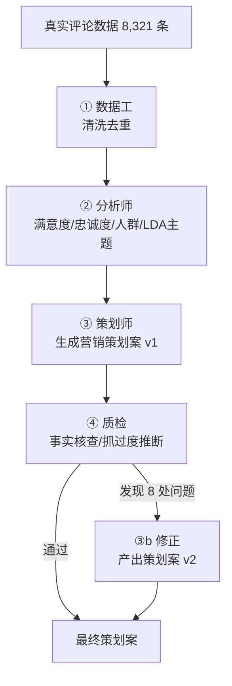

# COSRX 消费者洞察 → 营销策划 Agent

> 从真实商品评论自动产出「消费者洞察 + 营销策划案」。用 4 个 Agent 分工 + 质检兜底，让策划案里的**每一个数字都可追溯到原始数据**。

---

## 一、背景

营销策划岗最核心的能力，是「用数据支撑创意」。但传统手工流程有三个痛点：

1. **评论读不完**：几千上万条消费者评论，人工根本读不过来；
2. **创意靠拍脑袋**：痛点靠印象归纳，策划案没有数据证据；
3. **没人复核**：结论错了、推断过头了，发出去前没人发现。

这个项目把「读评论 → 挖洞察 → 出策划」这条链路自动化，**人只保留 AI 替代不了的营销判断**。

## 二、目标

输入一批真实商品评论，自动产出：

- **消费者洞察报告**（满意度 / 忠诚度 / 人群画像 / 痛点，带硬指标）
- **营销策划案**（人群定位 + 内容选题 + 活动策划 + 关键话术，每个结论可追溯）

## 三、多 Agent 架构



| Agent | 角色 | 职责 | 产出 |
|---|---|---|---|
| ① 数据工 | 清洗 | 读原始评论 → 去重、去噪、规范化 | 干净数据 + 质量报告 |
| ② 分析师 | 洞察 | 满意度/忠诚度/人群画像 + LDA 主题挖掘 | `insights.json` + `lda_topics.json` |
| ③ 策划师 | 策划 | 把洞察翻译成营销策划案（调用大模型） | `marketing_plan.md` |
| ④ 质检 | 把关 | 逐条核查策划案的数字能否追溯到数据 | `qa_report.md` |
| ③b 修正 | 迭代 | 根据质检报告收敛过度推断 | `marketing_plan_v2.md` |

## 四、数据说明（真实来源）

- **来源**：Kaggle 公开数据集 [`ibrahimhafizhan/cosrx-products-catalog-and-reviews`](https://www.kaggle.com/datasets/ibrahimhafizhan/cosrx-products-catalog-and-reviews)，韩国品牌 COSRX 在印尼电商平台 Sociolla 上的真实用户评论。
- **规模**：原始 8,321 条评论，清洗去重后 **8,316 条**，覆盖 2 个产品（Aloe 防晒霜、Advanced Snail 92 蜗牛霜）。
- **字段**：4 维度评分（效果/包装/质地/性价比）、推荐意愿、复购意愿、年龄、肤质、评论文本等。

## 五、如何运行

依赖：Python 3.9+，`pandas`、`scikit-learn`。

```bash
pip install pandas scikit-learn          # 装依赖（首次）
python scripts/agent1_data_cleaner.py    # ① 数据工
python scripts/agent2_analyst.py         # ② 分析师（结构化洞察）
python scripts/agent2_lda.py             # ② LDA 主题挖掘
python scripts/agent3_planner.py         # ③ 策划师（需 DEEPSEEK_API_KEY）
python scripts/agent4_qa.py              # ④ 质检
python scripts/agent3_revise.py          # ③b 修正（产出 v2）
python scripts/agent3_campaign.py        # ③c 执行方案（需 DEEPSEEK_API_KEY）
```

## 六、核心结果（硬指标，全部来自真实数据）

| 指标 | 数值 |
|---|---|
| 满意度·效果均分（满分5） | **4.67** |
| 满意度·性价比均分（满分5，四维最低） | **4.42** |
| 推荐率 | **95.3%** |
| 复购意愿率 | **76.3%** |
| 核心人群 19–29 岁占比 | **68.3%**（在有年龄标注的评论中） |
| LDA 主题数 | **6 个**（肤感类主题合计占 51%） |
| 质检抓出的过度推断 | **8 处**（已全部修正） |

## 七、局限（诚实声明）

1. 数据来自 **Sociolla（印尼市场）**，评论多为印尼语，结论代表印尼市场，不能直接外推到其他市场；
2. 只覆盖 **2 个产品**，不代表 COSRX 全产品线；
3. 年龄字段约 **25% 缺失**，肤质标签**无交叉信息**（不能说「黑头+混合肌+毛孔是同一群人」）；
4. 关键词**词频 ≠ 情感极性**，情感判断主要依赖结构化评分字段；
5. LDA 为无监督聚类，**主题命名需人工解读**；
6. 策划案由大模型生成，**虽经质检，仍需人工做最终营销判断**。

